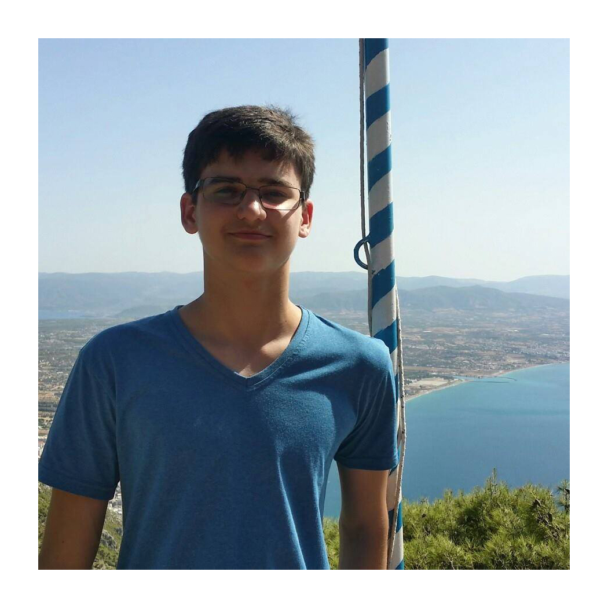
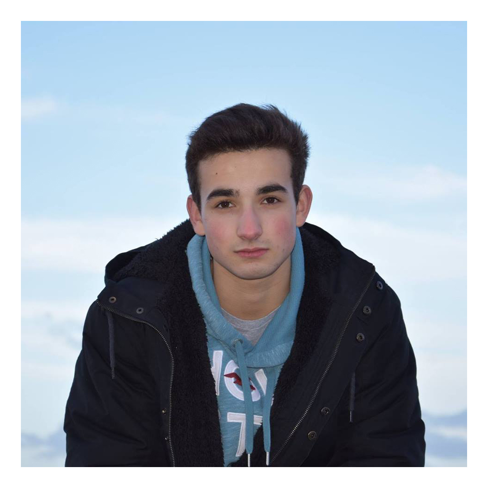
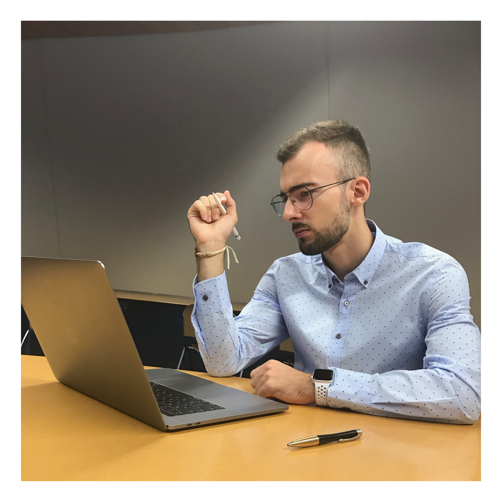
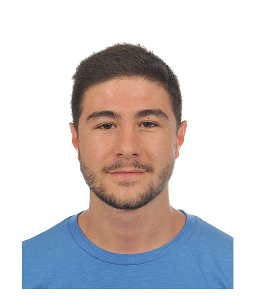

 
 

 

## 
 PROJECT STATUS 

Pipeline status:   &emsp; &emsp;
Client coverage:  &emsp; &emsp;
Server coverage:  &emsp; &emsp;

   

## 
 OVERVIEW 

Our application aims to encourage people to change their lifestyle by allowing them to track their **CO2 consumption**. They can **add friends** and **compare their carbon footprint**, while also receiving **achievements and badges** for certain milestones, such as eating 250 vegan meals. The application stores each user’s data on a **secure database**, which can only be accessed through our server, so each user’s information is safely stored.

   

## 
 BUILT WITH 

**Build management system**  
 Gradle  

**Frameworks**  
 Spring Boot  
 JavaFX  

**Platform**  
 Heroku  

**Database**  
 Postgres  

   

## 
 FEATURES 

**Food**  

*  Possibility to choose between 6 different types of meals: 
    *  vegan 
    *  vegetarian 
    *  pascetarian 
    *  low meat 
    *  medium meat 
    *  high meat 
*  Envy-me app allows you to **customize a meal** with a visual representation of the plate 

  

**Transportation**  

*  Possibility to choose between 5 different types of transportation: 
    *  walking 
    *  cycling 
    *  public transport 
    *  car 
    *  plane 
*  Choose between specifying **origin-destination** or **origin-distance**

   

   

**Utilities**  
*  Send you montly bills and **get points for it**!
*  Installation of **solar panels** or high **green energy** percantage will *boost* you score even more!

     

  

 **Profile & Friends**
*  Check out other people pages and find new friends!
*  Get more friends and **get an achievement for it**! 
*  Build your **green network** and **make the planet cleaner**!
*  If you have more than one car it's no longer a problem - you can add all of your cars to your profile

    
**
 AND MANY MORE! 
**
 

   

## 
 TEAM MEMBERS 

### Razvan Hilea

**Personal Development Plan**

GOALS:

1) Learn how it’s like to work in a group for a big project. 
	a. I worked before on some smaller projects with friends and we always ended up abandoning because we weren’t determined enough to overcome our lack of knowledge.  
	b. At the end of this project I hope to look back and think “Damn did we do a fine job 😊”

2)	Learn how servers work.
a.	Same as above, had issues with networking before and I’m really interested in learning how they work.

REALITY:

Yes, everyone in the team seems excited and determined to work hard for this project, which motivates me even more.

OPTIONS:

Working earnestly is enough for now, while also making sure we don’t fall behind schedule. I’d also encourage open communication between us, i.e. when someone has something unclear or a bug they can’t figure out.

WILL:

I’m determined to focus on this project and make something great out of it, starting right now. My teammates can help by keeping the morale up. I think the action plan that would help me achieve my goal would be on the scrum board.

 

### Marin Duroyon

 

**Personal Development Plan**

One of my strong points is creativity, I have an active mind constantly helping me to come up with new ideas or designs for my projects. I believe I can contribute to the artistic side of this project, figuring out how to appeal to the client. 
Moreover, I am a hardworker when it comes to projects. Envisioning the final product drives me to study and collaborate in order to achieve the final goal. This will help in team collaboration as I will often motivated others to complete a task.

However, I lack the skill of collaborating with others. I will usually take over a project in order to fully understand the functionalities of the program. In a team, I may have the tendency to constantly check and take on different tasks that I should belong to my team members.
Finally, I believe I am too fast on the trigger, meaning I will rather start programming than thinking. Therefore, I will find myself in situations where my projects are rather rudimentary and have no place to grow due to poor planning.

My learning goal this quarter is to mostly get rid of my current weaker points. This is important because I am able to identify the points that, in my opinion, pull me down, therefore I can act upon them. Throughout these weeks, I will try to spend more time planning my ideas and let my team members work on their own while still understanding the program. The later will be seen throughout the creation of the product, but the increase in planification will be critical from the start. 

 

### Ilya Grishkov 

**Personal Development Plan**

STRONG POINTS:

*   I’m well organized and always follow deadlines 
*   Ability to balance workloads efficiently 

The first rule I've been trying to follow trough my entire life. Before taking any task you have to be sure that you’ll be able to finish it, and after you’ve taken the project you have to make everything possible to finish it.
My second strong point is a way of achieving the first one. I had the problem, when I was a kid: I always got extremely passionate about something new and was able to spend hours doing that, but after a few days all of the passion disappeared. At some point I found a way to reorganize myself and distribute workload more efficiently. 

WEAK POINTS:

*   I default to believing that I can solve any problem on my own
* 	Sometimes not comfortable taking risks

Both those qualities pull me back. The way to solve them is rather clear - take action in a team. By doing it you take some to some degree, because you’re entering realm of unknown for you and learning how to work in a team. 

GOAL:

My final goal is to get more experience working in a team (especially with the people who I hadn’t chosen to work with), so I can adopt to the real world projects that are done in groups where no-one usually knows each other. It’s an essential skill that I want to get out of this project. 
Nevertheless everyone wants their work to be appreciated and valued, so it would have been wrong to deny the fact that getting a good grade is part of my goal. 

WILL: 

I believe that this project is a great opportunity to improve my weak points. The process of self improvement started for me at the time I arrived in Delft and this course will be a great contribution to it.

 

### Edoardo Lanzini

**Personal Development Plan**

STRONGPOINTS:
* Positive Attitude
* Communication

WEAKPOINTS:
* Lack of experience
* Lack of attention to details

In the past I never tackled such a big project with such a big team.
Therefore, my goal is to have a clear idea of how the development process works from start to finish. At the same time, I look forward to work collectively as a team, helping each other when necessary and equally splitting the work.

In order to achieve my goal, I am actively researching planning techniques and learning from more experienced developers. Our team created a scrumboard in order to equally divide the work that needs to be done.
More importantly, the fact that none of our team members is extremely experienced with the technologies will push each of us to contribute more and learn from each other.

From the start, I want to get an understanding of the big picture and see how the different parts of the application are connected.
