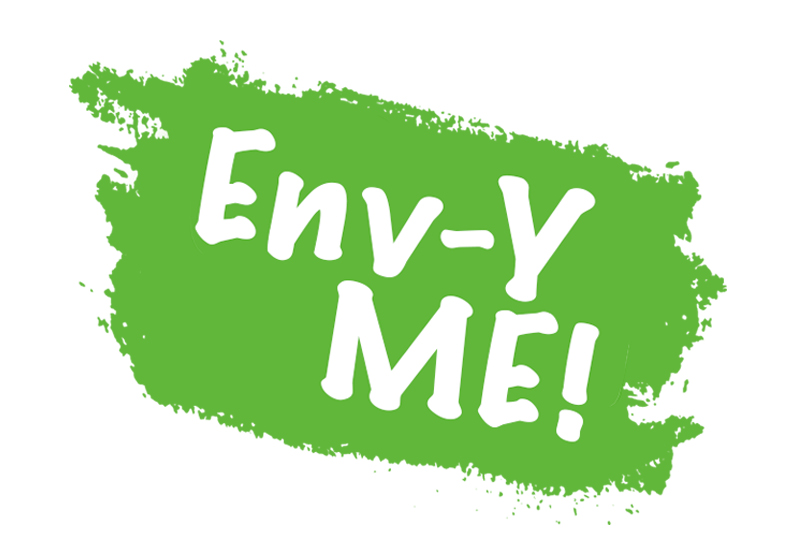
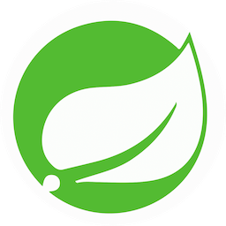
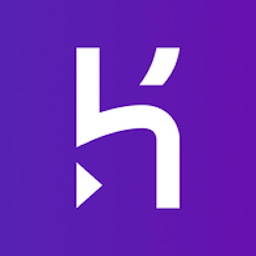
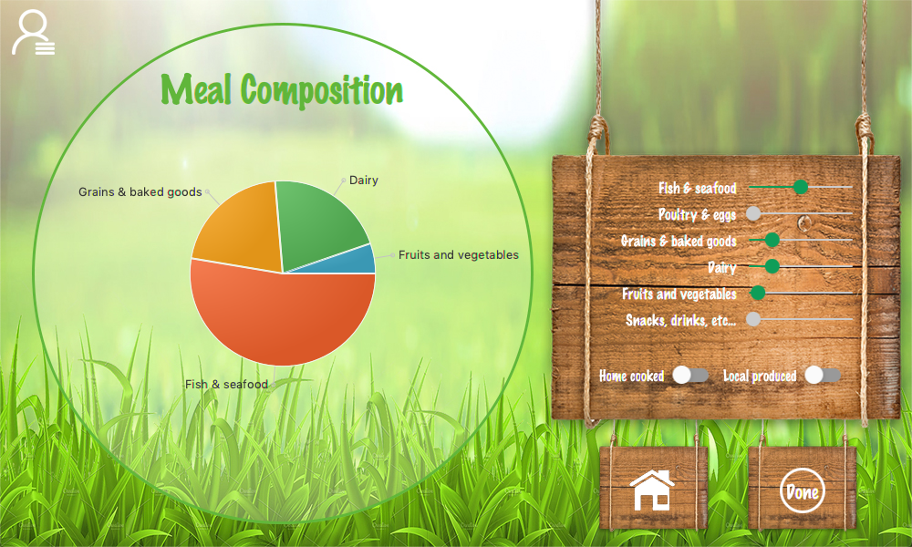
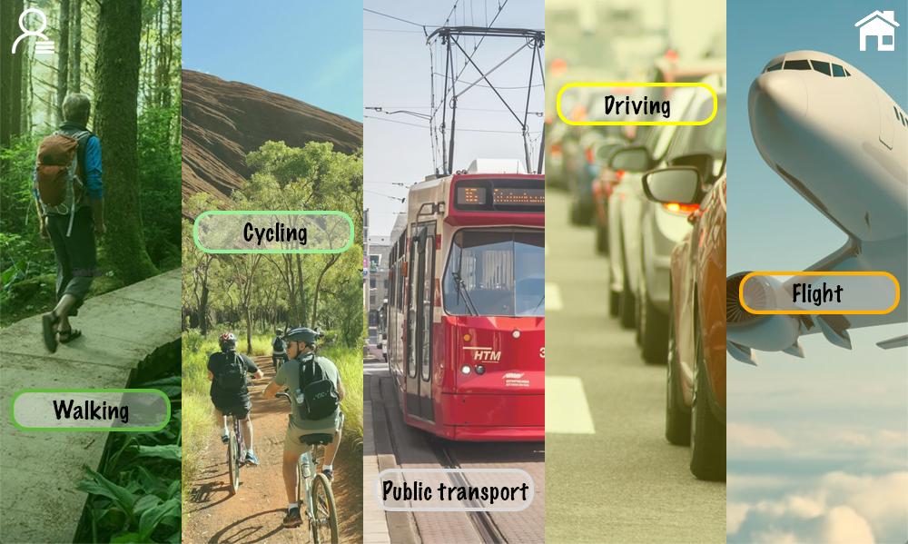
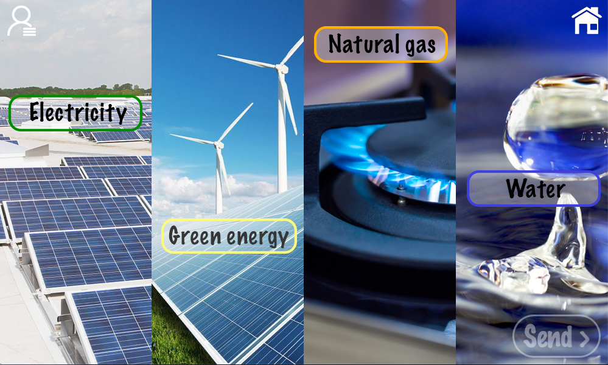
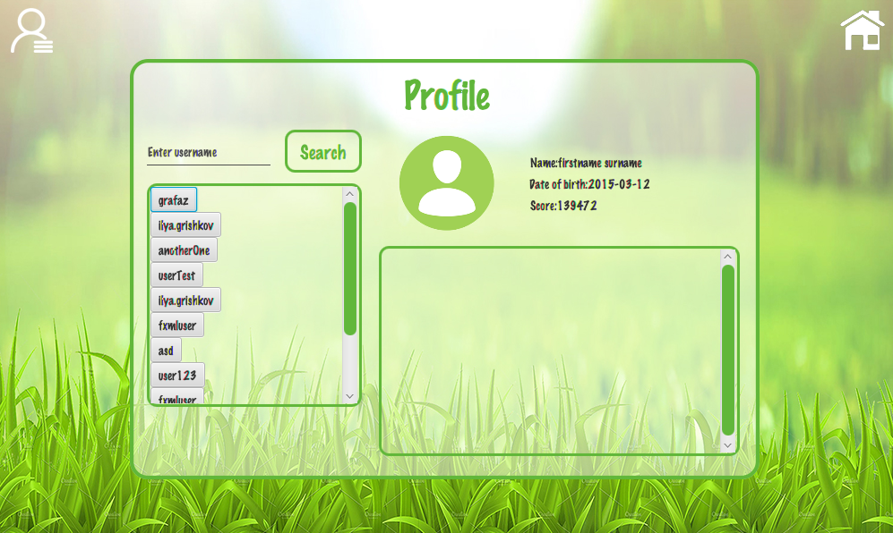

 
 

 

## 
 OVERVIEW 

Our application aims to encourage people to change their lifestyle by allowing them to track their **CO2 consumption**. They can **add friends** and **compare their carbon footprint**, while also receiving **achievements and badges** for certain milestones, such as eating 250 vegan meals. The application stores each user’s data on a **secure database**, which can only be accessed through our server, so each user’s information is safely stored.

   

 ## 
 TEAM MEMBERS 

 **
 Ilya Grishkov &emsp;&emsp; Edoardo Lanzini &emsp;&emsp; Marin Duroyon &emsp;&emsp; Razvan Hilea
**
 

  

## 
 BUILT WITH 

**Build management system**  
 Gradle  

**Frameworks**  
 Spring Boot  
 JavaFX  

**Platform**  
 Heroku  

**Database**  
 Postgres  

  

## 
 FEATURES 

**Food**  

*  Possibility to choose between 6 different types of meals: 
    *  vegan 
    *  vegetarian 
    *  pascetarian 
    *  low meat 
    *  medium meat 
    *  high meat 
*  Envy-me app allows you to **customize a meal** with a visual representation of the plate 

  

**Transportation**  

*  Possibility to choose between 5 different types of transportation: 
    *  walking 
    *  cycling 
    *  public transport 
    *  car 
    *  plane 
*  Choose between specifying **origin-destination** or **origin-distance**

   

   

**Utilities**  
*  Send you montly bills and **get points for it**!
*  Installation of **solar panels** or high **green energy** percantage will *boost* you score even more!

     

  

 **Profile & Friends**
*  Check out other people pages and find new friends!
*  Get more friends and **get an achievement for it**! 
*  Build your **green network** and **make the planet cleaner**!
*  If you have more than one car it's no longer a problem - you can add all of your cars to your profile

    
**
 AND MANY MORE! 
**
 

